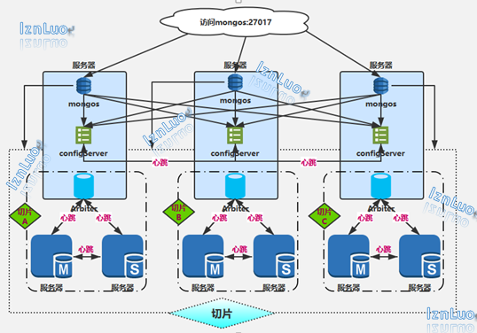

# MongoDB

使用docker-compose单机快速搭建mongo切片集群的测试环境

## MongoDB切片集群高可用架构图
https://www.processon.com/view/5cc56d70e4b059e20a0c038b

## bash docker-compose.sh [args] 命令的使用
docker-compose.sh 脚本里封装了几个方法

命令 |   说明
------------ | -------------
bash docker-compose.sh up  |  一键部署mongodb切片集群
bash docker-compose.sh ps  |  查看所有服务的状态
bash docker-compose.sh logs service_name   |  查看对应服务的标准输出信息
bash docker-compose.sh --help  |  查看更多帮助